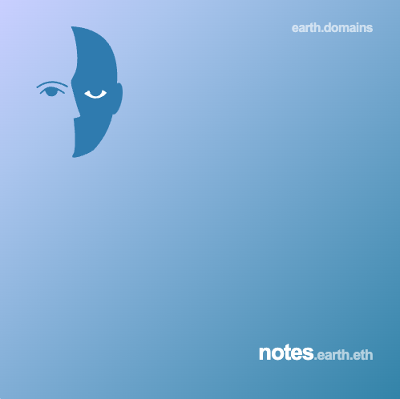

# notes.earth.eth 



Disclaimer: These are some personal notes. The information is provided "as is," with no assurance or guarantee of completeness, accuracy or timeliness of the information, and without warranty of any kind, express or implied, including but not limited to warranties of performance, merchantability and fitness for a particular purpose.

## TokenIDs

Given a domain ```label.earth.eth``` its token id is calculated through this function

```js
bytes32 node = 0x22d79776337f6faaa07dda9e51f4b3f6b8d1a713849ffb09aedea80544351b73;
uint256 tokenId = uint256(keccak256(abi.encodePacked(node, keccak256(bytes(label)))));
```

Please note that the only exception is for token ```000.earth.eth``` where its ID is ```15759554321153833020417644405955839441850404438221332357006384378189670849395```.


The complete list of ids for tokens with label ranging from ```000``` to ```9999``` (included) is available in the json file [ids.json](ids.json) that is
structured as follows:

```json
[
  {
    "token": "000",
    "id": "15759554321153833020417644405955839441850404438221332357006384378189670849395"
  },
  {
    "token": "001",
    "id": "17431835077329549566876003859996421296853224444567700628412047760691304752151"
  },
  
  ...
  
  {
    "token": "9999",
    "id": "38080290826396848769370679352037669586859072187345920740435083077257707111690"
  }
]
```
